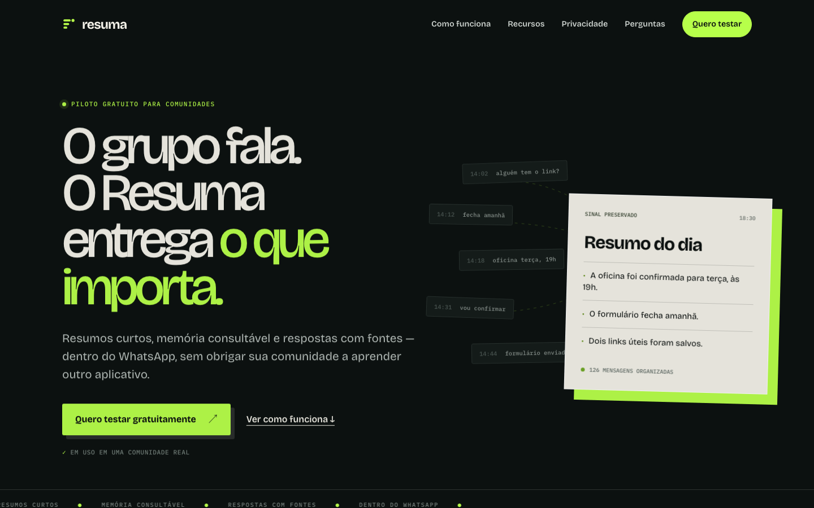
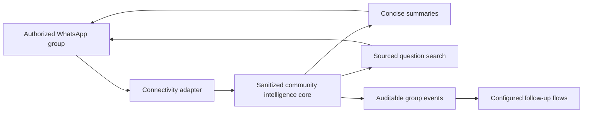

<p align="center">
  
</p>

<p align="center">
  <strong>Free intelligence for WhatsApp communities.</strong><br>
  Concise summaries, searchable group memory, and sourced answers — delivered where the conversation already happens.
</p>

<p align="center">
  <a href="https://resuma.ia.br">Website</a> ·
  <a href="https://luisroquette.github.io/resuma/">GitHub Pages</a> ·
  <a href="product/STATUS.md">Product status</a> ·
  <a href="SECURITY.md">Security</a>
</p>



## Why Resuma

Active communities produce useful knowledge and bury it at the same speed. Resuma turns authorized group conversations into short summaries and a queryable memory without asking members to adopt another application.

The product is currently running as a manually managed pilot. The public website intentionally separates working capabilities from roadmap ideas.

## Available in the pilot

- Concise text summaries with real topics, decisions, pending items, and links when present.
- Sourced `!pergunta` queries with a low-confidence fallback instead of a fabricated answer.
- Configured campaigns with scheduled or trigger-based delivery.
- Participant join and leave events with configurable follow-up flows.
- WhatsApp-native commands inside an authorized group.

See [Product Status](product/STATUS.md) for the claim and release rules used by every public surface.

## In development

- Automatically produced audio podcast.
- Advanced moderation with policies, appeals, and audit logs.
- Multi-community administration and tenant isolation.
- Safe self-service onboarding for administrators.

These capabilities are not part of the current pilot.

## Repository scope

This repository currently contains:

```text
brand/      Public brand system and logo assets
content/    Audited Brazilian Portuguese website copy
media/      Public product screenshots
product/    Product status and public claim rules
site/       Brazilian Portuguese commercial website
tests/      Browser tests for desktop, mobile, and no-JavaScript fallback
```

The organization-specific pilot engine, credentials, customer data, and private deployment configuration are not published here. A sanitized, provider-neutral core is planned for a later release after tenant isolation, consent, and security boundaries are complete.

## Local development

Requirements: Node.js 20 or newer, npm, Python 3, and Chromium for Playwright.

```bash
npm install
npm run serve
```

Open `http://127.0.0.1:4173`.

Run the browser validation:

```bash
npm test
```

## Architecture direction



The private pilot uses [Evolution API](https://github.com/EvolutionAPI/evolution-api) as its WhatsApp connectivity layer. Resuma is an independent project and is not affiliated with or endorsed by WhatsApp or Meta.

## Privacy and security

Resuma is designed around explicitly authorized groups, purpose limitation, administrator controls, and transparent product status. Public examples are simulated and contain no customer data.

Do not report vulnerabilities through public issues. Follow [SECURITY.md](SECURITY.md) for private reporting instructions.

## Contributing

The public core is not available yet, but website, documentation, accessibility, and localization improvements are welcome. Read [CONTRIBUTING.md](CONTRIBUTING.md) before opening a pull request.

## License and trademarks

Source code in this repository is licensed under the [MIT License](LICENSE). The Resuma name, logo, and visual identity are not granted for use as another product's brand; see [TRADEMARKS.md](TRADEMARKS.md).
