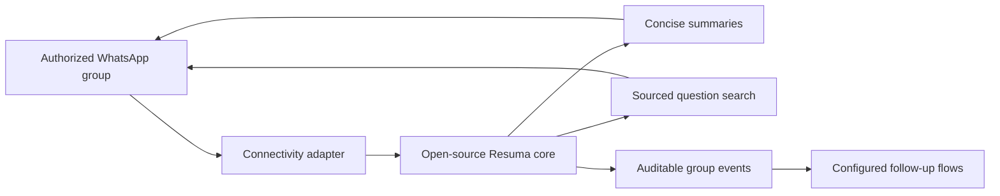

<p align="center">
  
</p>

<p align="center">
  <strong>Free intelligence for WhatsApp communities.</strong><br>
  Concise summaries, searchable group memory, and sourced answers — delivered where the conversation already happens.
</p>

<p align="center">
  <a href="https://luisroquette.github.io/resuma/">Live demo</a> ·
  <a href="docs/INSTALL.md">Install</a> ·
  <a href="product/STATUS.md">Product status</a> ·
  <a href="SECURITY.md">Security</a>
</p>


## Why Resuma

Active communities produce useful knowledge and bury it at the same speed. Resuma turns authorized group conversations into short summaries and a queryable memory without asking members to adopt another application.

The repository includes a provider-neutral, deterministic core that anyone can clone, run locally, and connect to an authorized messaging provider. The organization-specific pilot remains private.

## Available in the open-source core

- Concise text summaries with real topics, decisions, pending items, and links when present.
- Sourced `!pergunta` queries with a low-confidence fallback instead of a fabricated answer.
- Configured campaigns with scheduled or trigger-based delivery.
- Participant join and leave events with configurable follow-up flows.
- WhatsApp-native commands inside an authorized group.

No paid AI API is required. See [Product Status](product/STATUS.md) for the exact boundary between the public core and the private pilot.

## In development

- Automatically produced audio podcast.
- Advanced moderation with policies, appeals, and audit logs.
- Multi-community administration and tenant isolation.
- Safe self-service onboarding for administrators.

These capabilities are not part of the current pilot.

## Repository scope

This repository currently contains:

```text
brand/      Public brand system and logo assets
core/       Provider-neutral summaries, search, commands, events, and campaigns
content/    Audited Brazilian Portuguese website copy
examples/   Runnable local integration with simulated community data
media/      Public product screenshots
product/    Product status and public claim rules
site/       Brazilian Portuguese commercial website
tests/      Core unit tests and GitHub Pages browser tests
```

The repository never includes customer data, credentials, production group identifiers, or organization-specific campaign copy. Connectivity, durable storage, consent, and deployment remain explicit adapter responsibilities.

## Local development

Requirements: Node.js 20 or newer and npm. Python 3 and Chromium are only needed for browser tests.

```bash
git clone https://github.com/luisroquette/resuma.git
cd resuma
npm ci
npm run demo
```

The demo processes simulated messages, answers `!pergunta`, creates a concise summary, and sends a configured campaign after a participant leaves. Nothing is sent to WhatsApp.

Run all validations:

```bash
npm test
```

Read the [installation and adapter guide](docs/INSTALL.md) before connecting a real group.

## Architecture direction



The public core does not bundle or endorse a provider. The private pilot currently uses [Evolution API](https://github.com/EvolutionAPI/evolution-api) behind an adapter. Resuma is independent and is not affiliated with or endorsed by WhatsApp or Meta.

## Privacy and security

Resuma is designed around explicitly authorized groups, purpose limitation, administrator controls, and transparent product status. Public examples are simulated and contain no customer data.

Do not report vulnerabilities through public issues. Follow [SECURITY.md](SECURITY.md) for private reporting instructions.

## Contributing

Core adapters, storage implementations, tests, documentation, accessibility, and localization improvements are welcome. Read [CONTRIBUTING.md](CONTRIBUTING.md) before opening a pull request.

## License and trademarks

Source code in this repository is licensed under the [MIT License](LICENSE). The Resuma name, logo, and visual identity are not granted for use as another product's brand; see [TRADEMARKS.md](TRADEMARKS.md).
